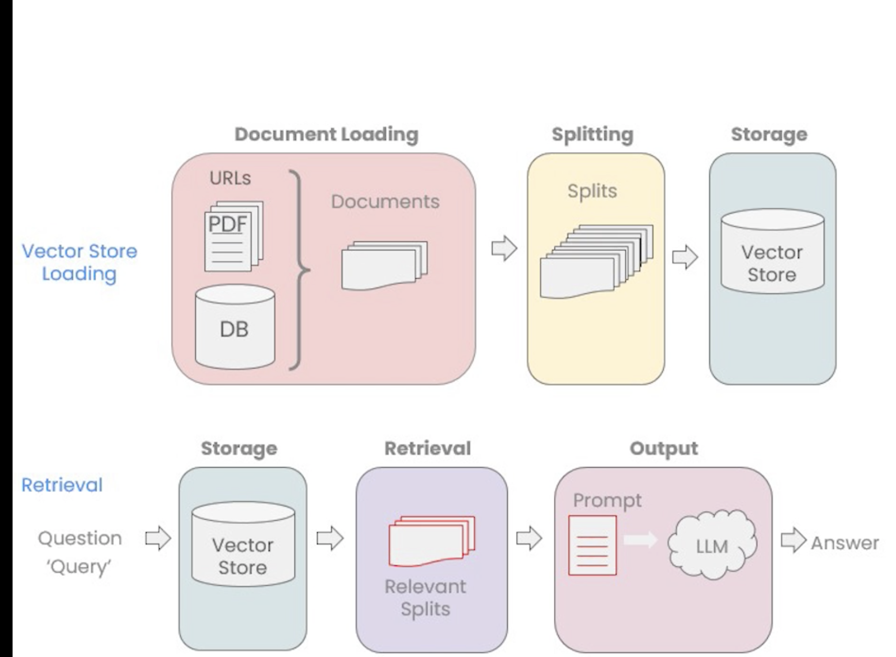

# langchain-samples
Python code for samples at LangChain Chat with Your Data course of https://learn.deeplearning.ai/
See original github repo https://github.com/ksm26/LangChain-Chat-with-Your-Data/

# prerequisites on environment
(Tested on macOS 14.2 Sonoma)

	xcode-select --install

	brew install python

	pip3 install langchain (https://pypi.org/project/langchain/)
	pip3 install langchain-community
	pip3 install openai

	Obtain OpenAI API Key http://www.openai.com Add OpenAI API Key OPENAI_API_KEY in .zshenv file

# prerequisites on pdf sample
	pip3 install python-dotenv
	pip3 install langchain-community

 
# prerequisites on youtube sample
	brew install fprobe
	brew install ffmpeg
	pip3 install yt_dlp
	pip3 install pydub
	
The 429 error {'error': {'message': 'You exceeded your current quota, please check your plan and billing details. For more information on this error, read the docs: https://platform.openai.com/docs/guides/error-codes/api-errors.', 'type': 'insufficient_quota', 'param': None, 'code': 'insufficient_quota'}} is avoid if account for OpenAI API is charged with some credit.

# prerequisites on HTML sample
	pip3 install bs4

# prerequisites on Text Splitter sample
No prerequisites

# Prerequisies on Vector Stores sample
    pip3 install -U langchain-openai
    pip3 install tiktoken
    python3 -m pip install tiktoken
    python3 -m pip install chromadb
    Add on PATH '/Library/Frameworks/Python.framework/Versions/3.11/bin'
# Prerequisites on Retrieval sample
    pip3 install lark
    pip3 install scikit-learn
# Prerequisites on Question Answering sample
No prerequisites
# Prerequisites on Conversational chatbot sample
    pip3 install pydantic==1.10.8  (it does not work with last pydantic version)
    pip3 install panel
    pip3 install docarray
# Prerequisites on testPretrained sample
    pip3 install torch torchvision
    pip3 install text-generation
    BUILD_CUDA_EXT=0 pip install auto-gptq ( reember disable CUDA if non-nvdia GPU)
    brew install poppler (prerequisite pdf2image)
    pip3 install pdf2image
    pip3 install -U sentence-transformers==2.2.2 (important force version to 2.2.2 or we will face : TypeError: INSTRUCTOR._load_sbert_model() got an unexpected keyword argument 'token')
    pip3 install InstructorEmbedding
    pip3 install einops
    (When running on CPU => python3 testPretrained.py --autolaunch --skip-torch-cuda-test --disable-nan-check --no-half --use-cpu all)

